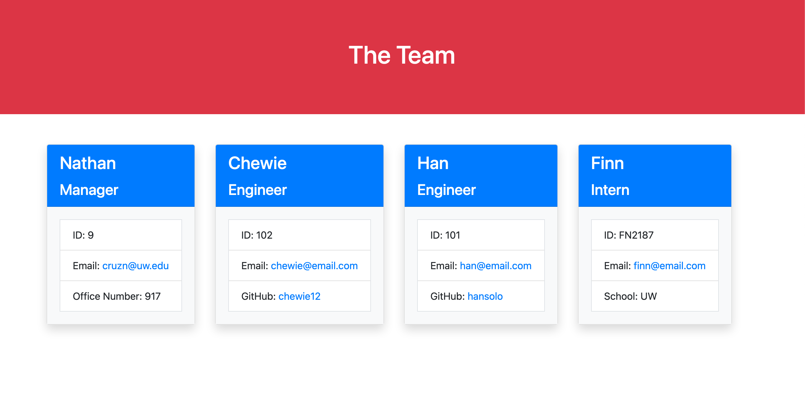
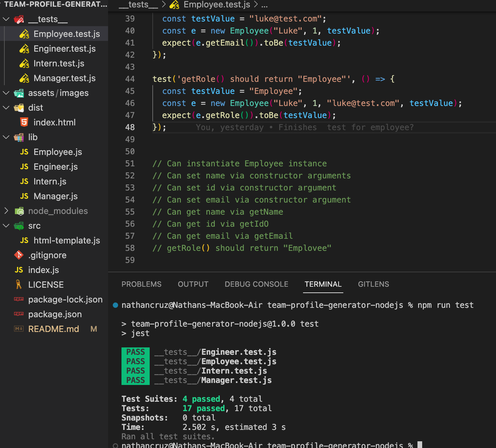
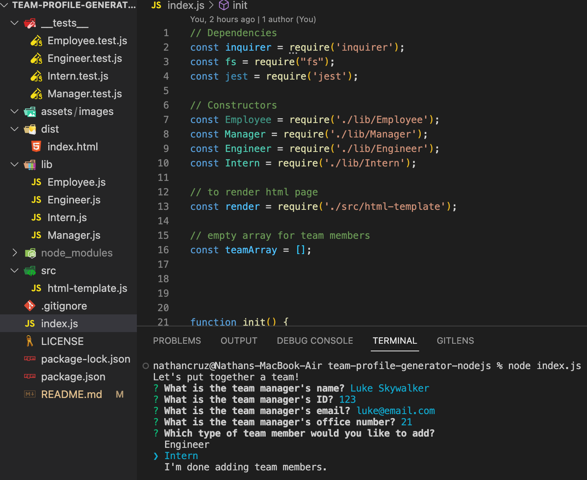

# Team Profile Generator Node.js

## Description
This project was a challenge assigned to us where we had to create a Node.js command-line application that takes in information about employees on a software engineering team, then generates an HTML webpage that displays summaries for each person. We were not given any starter code and uses Inquirer and Jest.

When you run the application in the Command-Line Interface, you are prompted with questions about the members of your team such as: name, email address, ID, GitHub username, Office Number, etc. depending on what role the person has. After completing the team roster, an HTML file is generated to display each employees' profile.  

This challenge was similar to challenge 9 using Node.js and creating a file from user's input. I found this challenge to be much more difficult that the last even though it had similarities but I became more comfortable working in the command line. Having no starter code made me have to really plan out and pseudocode what would happen but also, the introduction of tests was something that took me a while to comprehend, mainly after I completed other parts of the challenge. I ran into issues when I ran npm test, it would go into an infinite loop. The cause of the problem was in the package.json where under 'test', it was 'npm run test' instead of just 'jest.' I also ran into a lot of bugs when creating my tests when I didn't have the correct letter case in some of the functions and variables causing me to have to go back and really look into my code. Saving the inputs to a file with the filesystem was still something I am learning how to do and it took me a while to be able to save the html file in the dist folder as I was trying to figure out how the path works for the fs file system.

## Usage
This application generates a Team Profile HTML file when used in the Command Line. When entering node index.js in the CLI, you are immediately prompted with questions to fill in the HTML template. Its creation is a way to practice using the CLI, JavaScript, node, json packages, inquirer, jest, and dependecies.

[Link to Repository](https://github.com/crzn24/team-profile-generator-nodejs.git)

[Walkthrough Video Demo](https://drive.google.com/drive/folders/12X9sCBjPHcrAmdjOKrDoqVA-TdxVLqoP?usp=sharing)

## Credits
* [Switch Statements](https://developer.mozilla.org/en-US/docs/Web/JavaScript/Reference/Statements/switch)
* [W3 Schools Node.js Filesystem](https://www.w3schools.com/nodejs/nodejs_filesystem.asp)

## License

MIT License